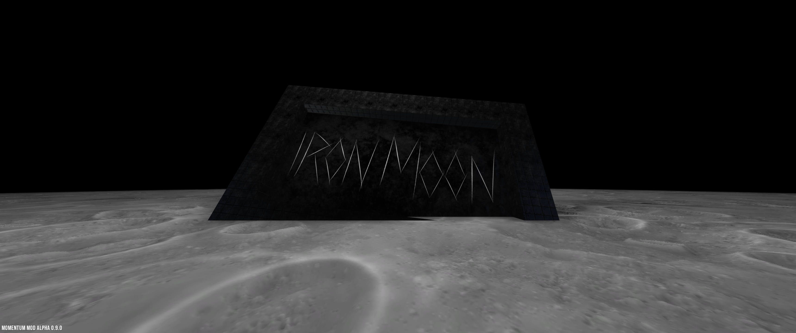

# Iron Moon

A sticky jump map for Momentum Mod inspired by the poem "I swallowed an iron moon" by Xu Lizhi and the song "Iron Moon" by Chelsea Wolfe.

## Screenshots

## Shoutouts

Big thanks to:
- False_ (@EthanV-3D) for general mapping help
- fingerprince (@tsa96) for help with converting textures to source and using PBR/parallax
- Ninja Cookie (@NinjaTheCookie) for general mapping help

## Resources

- PBR textures from Substance3D (https://substance3d.adobe.com/assets/allassets)
- Skybox from Mr. Who's port of some Space Engineers' skyboxes (https://gamebanana.com/mods/7923)
- Sounds from Sonniss' many GDC soundpack releases (https://sonniss.com/gameaudiogdc#1605030813191-c5a1f3d0-8baf)
